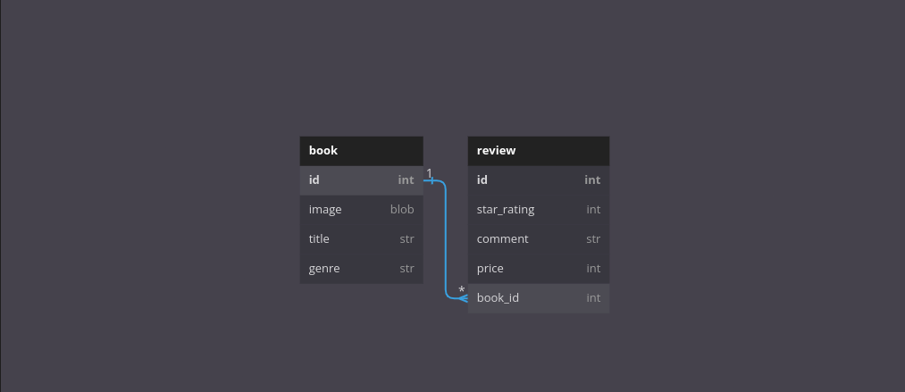

### PHASE 3 PROJECT

#### Project name

    - Kitabu Reviews

#### Project description

    - Kitabu Reviews reviews literature books by commenting and rating the books.

#### author information

    The following projects are created by:
    - Paul Wanyoike Ngugi
    - on 24/02/2023

#### setup/installation requirements

    - download a zip file under code tab.
    - extract the downloaded zip folder
    - open the folder with VS code
    - Run this command on the terminal to run the server:
      console $ bundle install
      console $ bundle exec rake server
    - Run the deployed react app down below

##### Entity Relational Diagram

##### BDD

As a user should;

    -

##### Known Bugs

    The application works perfectly well, no bugs.

#### technologies used

    The following projects used the technologies
    :
    - RUBY
    - SQLite3
    - Active Record
    - React
    - HTML
    - CSS
    - JS

#### Support and Contact information

    Email: paulnyoiken@gmail.com
    Phone: +254718741382

#### License and Copyright Information

Copyright 2023 Paul Wanyoike Ngugi Licensed under [MT License]()

#### Video Link

